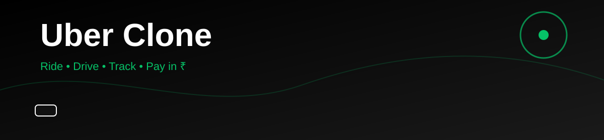
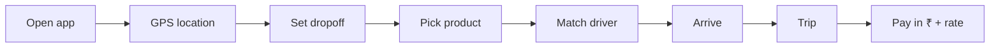

<div align="center">


<br/>



<br/>


**A full ride-hailing clone** — request a cab, watch the driver arrive, or go online and earn.

[Live Demo](https://uber-ten-bay.vercel.app/) · [Features](#-features) · [Deploy](#-deploy-on-vercel)

</div>

---

## ✨ Features

<table>
<tr>
<td width="50%">

### Rider
- GPS pickup from your real location
- Search or tap the map for dropoff
- UberX · Comfort · XL · Black
- Upfront fares in **₹**
- Live car matching & trip progress
- Rate the ride, see activity history

</td>
<td width="50%">

### Driver
- Go online / offline
- Incoming requests near you
- Accept, navigate, complete
- Today’s earnings in **₹**
- Same live map as riders

</td>
</tr>
</table>



---

## 🛠 Tech stack

<p align="center">
  
</p>

| Layer | What |
| --- | --- |
| App | Next.js 14 App Router + TypeScript |
| UI | Tailwind CSS, Uber-style black / green |
| Maps | Google Maps if a key is set, OpenStreetMap fallback |
| Location | Browser GPS + reverse geocode |
| State | Local demo auth & trip history |

---

## 🚀 Run locally

```bash
git clone https://github.com/<your-username>/UBER.git
cd UBER
npm install
npm run dev
```

Open [http://localhost:3000](http://localhost:3000) and **allow location**.

### Optional Google Maps key

Create `.env.local`:

```env
NEXT_PUBLIC_GOOGLE_MAPS_API_KEY=your_key_here
```

If the key is missing or invalid, the app uses OpenStreetMap automatically — no watermark, no error overlay.

---

## ☁️ Deploy on Vercel

[](https://vercel.com/new)

1. Push this repo to GitHub
2. Import at [vercel.com/new](https://vercel.com/new)
3. Framework: **Next.js** (defaults)
4. Optional env: `NEXT_PUBLIC_GOOGLE_MAPS_API_KEY`

---

## 📁 Pages

| Route | Screen |
| --- | --- |
| `/` | Landing |
| `/login` | Demo login (rider / driver) |
| `/rider` | Book a ride |
| `/driver` | Driver mode |
| `/activity` | Trip history |
| `/account` | Profile |

---

<div align="center">


<sub>Not affiliated with Uber Technologies, Inc. For learning & portfolio use.</sub>

</div>
